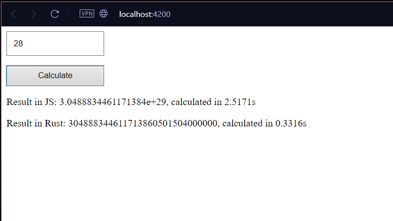

# Angular Wasm Project

This project was created following the medium from [Oz](https://medium.com/@eugeniyoz) named [Powering Angular with Rust (Wasm)](https://medium.com/@eugeniyoz/powering-angular-with-rust-wasm-0eed1668a51c)

It use Angular 18.0.5 and Rust 1.78.0 with wasm_bindgen 0.2 to generate the web page.

You can see an example in the image bellow:

## Development server

Run `ng serve -o` for a dev server. Navigate to `http://localhost:4200/`. The application will automatically reload if you change any of the source files.

## Build

Run `ng build` to build the project. The build artifacts will be stored in the `dist/` directory.

## Further help

To get more help on the Angular CLI use `ng help` or go check out the [Angular CLI Overview and Command Reference](https://angular.dev/tools/cli) page.
